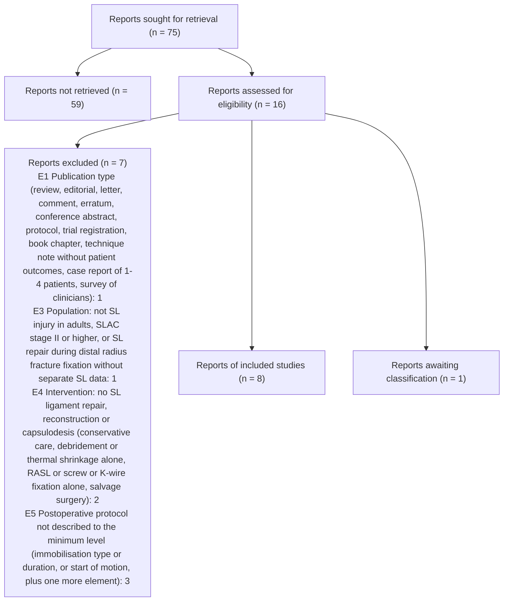

# PRISMA 2020 counts - full-text stage



```json
{
 "stage": "ft",
 "tool": "sr-screener 1.0.0",
 "complete": true,
 "pending_records": 0,
 "pending_ta_records": 0,
 "pending_ta_qc_records": 0,
 "fulltext_set_out_of_date": false,
 "state_problems": [],
 "reports_sought_for_retrieval": 75,
 "reports_not_retrieved": 59,
 "reports_assessed": 16,
 "reports_to_assess": 16,
 "reports_excluded": 7,
 "excluded_by_reason": {
  "E1 Publication type (review, editorial, letter, comment, erratum, conference abstract, protocol, trial registration, book chapter, technique note without patient outcomes, case report of 1-4 patients, survey of clinicians)": 1,
  "E3 Population: not SL injury in adults, SLAC stage II or higher, or SL repair during distal radius fracture fixation without separate SL data": 1,
  "E4 Intervention: no SL ligament repair, reconstruction or capsulodesis (conservative care, debridement or thermal shrinkage alone, RASL or screw or K-wire fixation alone, salvage surgery)": 2,
  "E5 Postoperative protocol not described to the minimum level (immobilisation type or duration, or start of motion, plus one more element)": 3
 },
 "reports_unclear_awaiting_classification": 1,
 "studies_included_reports": 8,
 "agreement": {
  "n": 16,
  "both_advance": 7,
  "both_exclude": 7,
  "a_only_advance": 1,
  "b_only_advance": 1,
  "observed_agreement": 0.875,
  "kappa": 0.75,
  "pabak": 0.75
 },
 "decided_by": {
  "A+B": 14,
  "ADJ": 2
 }
}
```
