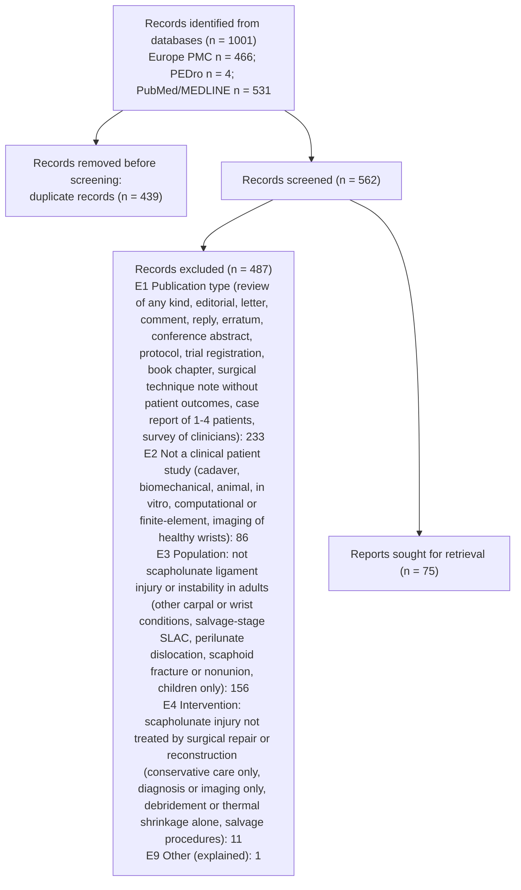

# PRISMA 2020 counts - title/abstract stage



```json
{
 "stage": "ta",
 "tool": "sr-screener 1.0.0",
 "complete": true,
 "pending_records": 0,
 "state_problems": [],
 "identified_by_database": {
  "Europe PMC": 466,
  "PEDro": 4,
  "PubMed/MEDLINE": 531
 },
 "identified_total": 1001,
 "duplicates_removed": 439,
 "records_screened": 562,
 "records_to_screen": 562,
 "records_excluded": 487,
 "excluded_by_code": {
  "E1": 233,
  "E2": 86,
  "E3": 156,
  "E4": 11,
  "E9": 1
 },
 "reports_sought_for_retrieval": 75,
 "advanced_include": 55,
 "advanced_unclear": 20,
 "advanced_outside_allowed_languages": 5,
 "agreement": {
  "n": 562,
  "both_advance": 70,
  "both_exclude": 487,
  "a_only_advance": 3,
  "b_only_advance": 2,
  "observed_agreement": 0.9911,
  "kappa": 0.96,
  "pabak": 0.982,
  "conflicts": 5,
  "resolved_by": {
   "A+B": 556,
   "ADJ": 5,
   "QC": 1
  }
 },
 "decided_by": {
  "A+B": 556,
  "ADJ": 5,
  "QC": 1
 }
}
```
